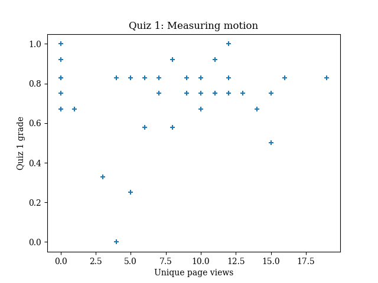
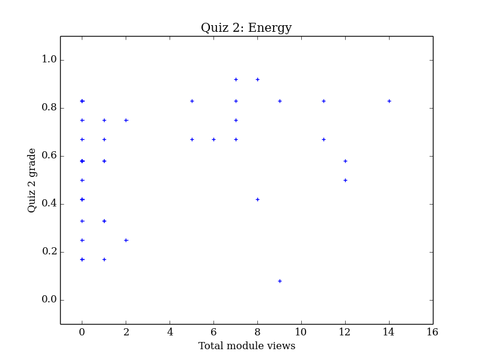
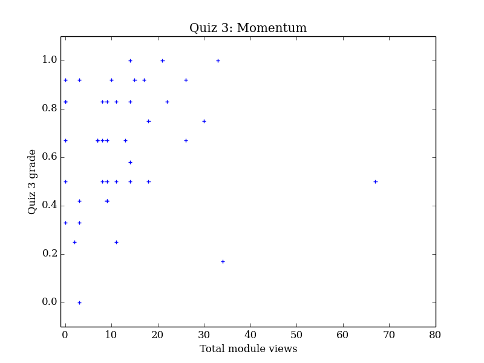
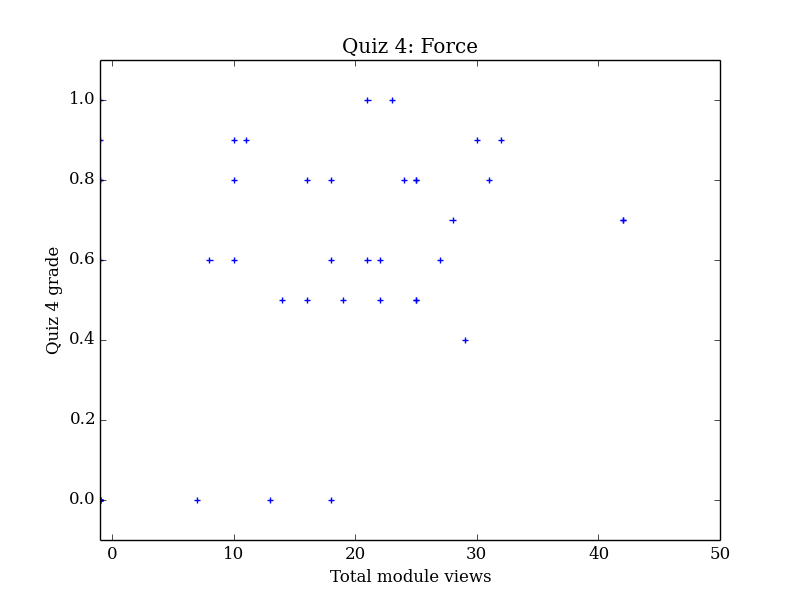
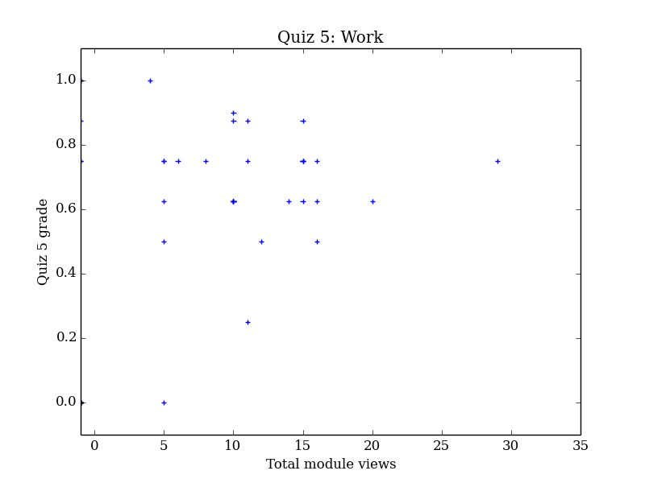

# Scholarship of Teaching and Learning
This website is my ongoing documentation of the Scholarship of Teaching and Learning project I started during the 2019/2020 Faculty Learning Community.

**Broady speaking**, I am investigating how students use the textbook to facilitate learning. This is not about _how often_ or _how much_ they use it (which as been studied), but in what _ways_ they are interacting with the textbook when they do use it. In terms of Pat Hutchings' taxonomy of questions,[1](#f1) I am interested in "what is" and "what works."

## Literature review
Interestingly, a brief literature review did not turn up much in regards to how students use textbooks. In the study *The Perceived Value of College Physics Textbooks: Students and Instructors May Not See Eye to Eye* by Podolefsky and Finkelstien,[2](#f2) students were surveyed on how much and when they read, and how it impacted their performance. This is about textbook usage in general, but does not get into specific details of how students use different aspects of the book.

A paper by Heiner, Banet, and Wieman,[3](#f3) titled *Preparing students for class: How to get 80% of students reading the textbook before class,* gets into the details of using one particular method of getting students to engage with the book, and very briefly (in one paragraph) presents some results from a survey where students answered the question "When I did the pre-reading assignment, I usually..." The responses are not particularly enlightening, at least to the level of detail that I am looking for.

The paper *Training in Metacognition and Comprehension of Physics Texts* by Koch[4](#f4) studied various strategies that can be taught to students to help them read more effectively. But like the others, this paper does not delve into how students use the book without any sort of intervention.

In *Conceptual or computational? Making sense of reading questions in an inverted statistics course*, Bruff[5](#f5) addresses a similar topic as what I'm looking into. Bruff investigated what students "are able to learn by reading their textbooks before class" as part of a study into what kinds of pre-class readings, assignments, and questions help the students learn more from their textbooks.

While at times frustrating, in some ways it is exciting to see a dearth of material published on this topic&mdash;it means the field is relatively open for exploration!

<!-- # Original line of inquiry: worked examples
I started out the project by designing a study to investigate how students use worked example problems to help them learn. I ran a pilot student where I presented a student with a short handout including information on some new material, a worked example, and a similar problem for the student to solve. I had them do this in the physics lab, and I was not there to answer questions or otherwise make them feel monitored. They did not have access to the internet or other physics textbooks. I collected the notes the student took on the handout as well as their work on the problem.

It looked like the student did effectively use the text and worked example to solve the practice problem: I found that at least one student was able to effectively use printed materials to help solve novel problems. There were a few things that stuck out to me as evidence of the student using the worked example:

1. Using a test case to verify relationships between two specific variables.
	- Test cases are sometimes done in intro physics class, but not emphasized as a problem-solving tool.
	- Using a test case was explicitly and clearly used in the worked example, and it looks like the student was mimicking that.
1. Using a negative potential energy in the analysis.
	- It is extremely uncommon to use negative potential energy at this level of physics.
	- The student's use of the technique here is almost certainly because they saw it in the example.

My original plan was to run this pilot study with three to five students. After seeing this one student's work, I felt it was not ultimately what I wanted to focus on. While it was nice to see that a student was able to use a worked example to facilitate learning, the situation (i.e. very few materials available to reference) was unrealistic.

Instead, I really want to see if we can train students to effectively use the textbook even when they are *not* limited in what resources are available. In other words, can we train them to use the textbook as a staring point?

This pilot study and analysis took place during winter quarter of 2020. -->

<!-- # Shift in direction: Correlating textbook usage to quiz scores -->
# Correlating textbook usage to quiz scores
<!-- After my pilot study, I decided to change tacks for spring 2020. -->

For Introduction to Physics (Phys 110), I use an online textbook. I wrote the book myself and published it through Computational Class Notes (CCN),[6](#f6) an ed-tech company specializing in applying the technical computing program Wolfram Mathematica[7](#f7) to generate examples and practice modules. Because of the computational backend, a student can refresh a module to see a new example or practice problem over the same material. A new problem is generated each time, rather than simply cycling through a bank of pre-written problems. Modules are embedded in a web page, often with multiple modules per page.

This provides me with a good source of data: I can pull a report that tells me specifically when each student accessed each module. The modules themselves are pointed and specific, so for each module I can refer to a specific quiz drawing on the material. There is a limitation, however: I only get a time stamp of when the student accessed the module, which does not provide me with information about how long a student was viewing a module, or if they even looked at it at all. The issue of what defines a "meaningful" interaction with an electronic text is addressed by Seaton, et al. in *Analyzing the Impact of Course Structure on Electronic Textbook Use in Blended Introductory Physics Courses.*[8](#f8)

## Results
For each module, I pull a report that gives a student's name, and a timestamp of when they accessed the module. I applied two criteria to remove data points from analysis:

1. If the access time was after the corresponding quiz, I removed the data point.
1. If two access times were within 60 seconds of each other, I only counted it as one "hit."

I made some observations while I was preparing the data:
1. The *vast majority* of hits for any given module came **after** the relevant quiz.
	- For example, one file went from 153 rows of data to 3 when I removed hits from after the quiz date.
1. There were few hits from the quiz day itself; this indicates students not referencing the book while taking the quiz. (Quizzes were open-book and open-notes, though there was a 60 minute time limit.) <!-- (Hopefully they were using their notes instead.) -->
1. Quiz 2 was very difficult, and I saw the number of access times dramatically increase between quiz 2 and quiz 3.
<!--- No wonder people did poorly on the quizzes! *What the hell did they expect!?* Also, the energy quiz (from which all the above examples come) had a remarkably low average. I allowed them to do corrections (which I saw no evidence of helping, given their exam grades) to make up for this. I should've told them to just go fuck themselves! Why should I do more work because they can't be assed to *read the fucking book* or *work on any fucking examples!?* --->

For each quiz, I counted the total number of hits on the corresponding modules. At this point I have analyzed the data for the first three quizzes:

At a glance, it looks like there is no meaningful correlation between module views and quiz grade. I will need to do some more quantitative statistical analysis to confirm this. <!-- It is possible that there's a sort of over/under effect: for example, on Quiz 2 it looks as though there *may* be a difference between students who viewed the modules fewer than four times as opposed to more than four times. -->

## Future work
Presented as a TODO, since this is still a work in progress.
- [x] Analyze quiz grade vs non-graded module hits
- [ ] Analyze quiz grade vs score on graded modules
- [ ] Statistical analysis to determine any sort of real correlation
- [ ] Look into exam scores?
	- [ ] Dig deeper into how reviewing after the quiz affects their grades?

---
# Aside: some ponderings on textbooks
One may ask if it is really necessary to train students to use a textbook, or ask why they even *should* use a textbook if there is so much information available online? These are valid questions, but I believe it is valuable for students to learn how to use textbooks. There is *too much* information available online, and much of it is wrong or irrelevant. It can take valuable "processing power" for a student to sift through and find what is helpful; this energy could be more efficiently spent with the focus of a textbook that was selected for a specific course. I also have the simple conviction that there is *inherent value* to learning how to use a textbook as a resource!

<!---Copyright and license--->
---
# Copyright and license info

Except as noted, all contents are copyright 2019 Dan Roth, and are licensed under a [Creative Commons Attribution-NonCommercial-ShareAlike 4.0 International License](http://creativecommons.org/licenses/by-nc-sa/4.0/).

<!--- References & notes --->
---
# References
1 P. Hutchings, *Opening Lines: Approaching the Scholarship of Teaching and Learning* (Carnegie Publications, The Carnegie Foundation for the Advancement of Teaching, Menlo Park, CA, 2000), p. 1. [↩](#a1)

2N. Podolefsky, and N. Finkelstein, The Physics Teacher, **44**, 338 (2009). <https://doi.org/10.1119/1.2336132> [↩](#a2)

3C. E. Heiner, A. I. Banet, and C. Wieman, American Journal of Physics, **82**, 989 (2014). <https://doi.org/10.1119/1.4895008> [↩](#a3)

4A. Koch, Science Education, **85**, 758 (2001). <https://doi.org/10.1002/sce.1037> [↩](#a4)

5 D. Bruff, in *Doing the scholarship of teaching and learning in mathematics*, edited by J. Dewar and C. Bennett (Chap. 13, Mathematical Association of America, Washington, DC). [↩](#a5)

6More info about CCN: <https://www.compclassnotes.com/about> [↩](#a6)

7<https://www.wolfram.com/mathematica> [↩](#a7)

8D. T. Seaton, G. Kortemeyer, Y. Bergner, S. Rayyan, and D. E. Pritchard, American Journal of Physics, **82**, 1186 (2014). <https://doi.org/10.1119/1.4901189> [↩](#a8)
